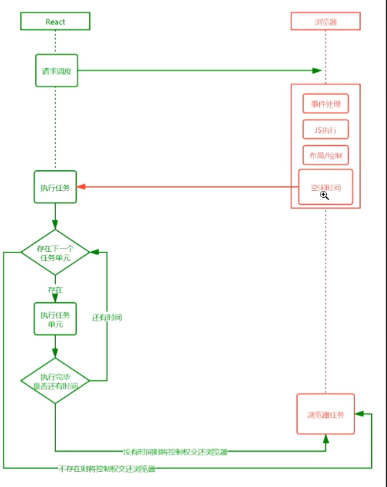
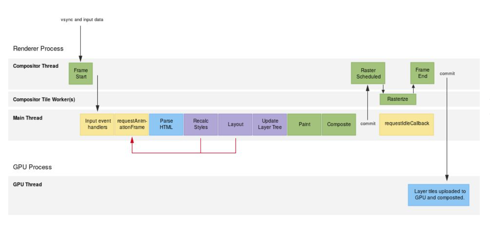
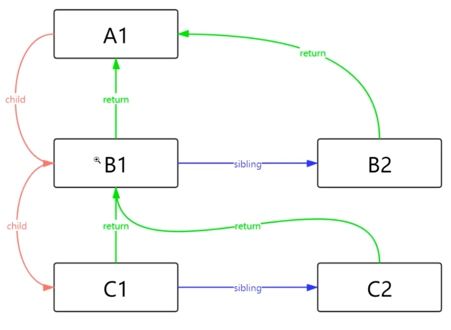
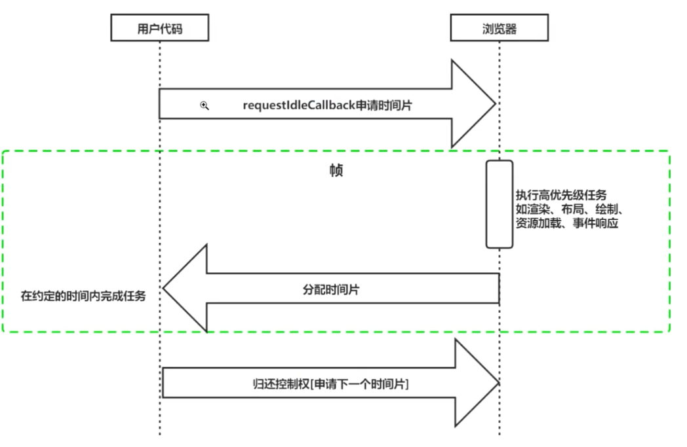

# React Fiber 运行流程图



# 帧的概念

- 目前大多数设备的屏幕的刷新率为60次/秒， 即60帧每秒， 人眼舒适放松时可视帧数是每秒24帧 ， 帧数 (fps) 越高，所显示的动作就会越流畅，小于这个值的时候，用户就会感觉到卡顿
- 所以对于现在主流屏幕设备来说，每个帧的预算时间就是1/60 约等于16.66毫秒
- 每个帧的开头包括样式计算、布局和绘制
- JavaScript执行Javascript引擎和页面渲染在同一个线程中，GUI渲染和Javascript执行两者之间是互斥的
- 如果某个任务执行时间过长，浏览器就会推迟渲染。



# Fiber 结构示意图



# window.requestAnimationFrame

**`window.requestAnimationFrame()`** 告诉浏览器——你希望执行一个动画，并且要求浏览器在下次重绘之前调用指定的回调函数更新动画。该方法需要传入一个回调函数作为参数，该回调函数会在浏览器下一次重绘之前执行

**注意：若你想在浏览器下次重绘之前继续更新下一帧动画，那么回调函数自身必须再次调用`window.requestAnimationFrame()`**

当你准备更新动画时你应该调用此方法。这将使浏览器在下一次重绘之前调用你传入给该方法的动画函数(即你的回调函数)。回调函数执行次数通常是每秒60次，但在大多数遵循W3C建议的浏览器中，回调函数执行次数通常与浏览器屏幕刷新次数相匹配。为了提高性能和电池寿命，因此在大多数浏览器里，当`requestAnimationFrame()` 运行在后台标签页或者隐藏的iframe里时，`requestAnimationFrame()` 会被暂停调用以提升性能和电池寿命。

回调函数会被传入[`DOMHighResTimeStamp`](https://developer.mozilla.org/zh-CN/docs/Web/API/DOMHighResTimeStamp)参数，[`DOMHighResTimeStamp`](https://developer.mozilla.org/zh-CN/docs/Web/API/DOMHighResTimeStamp)指示当前被 `requestAnimationFrame()` 排序的回调函数被触发的时间。在同一个帧中的多个回调函数，它们每一个都会接受到一个相同的时间戳，即使在计算上一个回调函数的工作负载期间已经消耗了一些时间。该时间戳是一个十进制数，单位毫秒，最小精度为1ms(1000μs)。

请确保总是使用第一个参数(或其它获得当前时间的方法)计算每次调用之间的时间间隔，否则动画在高刷新率的屏幕中会运行得更快。请参考下面例子的做法。


```
window.requestAnimationFrame(callback);
```

### [参数](https://developer.mozilla.org/zh-CN/docs/Web/API/Window/requestAnimationFrame#parameters)

- `callback`

  下一次重绘之前更新动画帧所调用的函数(即上面所说的回调函数)。该回调函数会被传入[`DOMHighResTimeStamp`](https://developer.mozilla.org/zh-CN/docs/Web/API/DOMHighResTimeStamp)参数，该参数与[`performance.now()`](https://developer.mozilla.org/zh-CN/docs/Web/API/Performance/now)的返回值相同，它表示`requestAnimationFrame()` 开始去执行回调函数的时刻。

### [返回值](https://developer.mozilla.org/zh-CN/docs/Web/API/Window/requestAnimationFrame#返回值)

一个 `long` 整数，请求 ID ，是回调列表中唯一的标识。是个非零值，没别的意义。你可以传这个值给 [`window.cancelAnimationFrame()`](https://developer.mozilla.org/zh-CN/docs/Web/API/Window/cancelAnimationFrame) 以取消回调函数。

```
const element = document.getElementById('some-element-you-want-to-animate');
let start;

function step(timestamp) {
  if (start === undefined)
    start = timestamp;
  const elapsed = timestamp - start;

  //这里使用`Math.min()`确保元素刚好停在200px的位置。
  element.style.transform = 'translateX(' + Math.min(0.1 * elapsed, 200) + 'px)';

  if (elapsed < 2000) { // 在两秒后停止动画
    window.requestAnimationFrame(step);
  }
}

window.requestAnimationFrame(step);
```

# requestIdleCallback

>  **这是一个实验中的功能** 

​	**`window.requestIdleCallback()`**方法插入一个函数，这个函数将在浏览器空闲时期被调用。这使开发者能够在主事件循环上执行后台和低优先级工作，而不会影响延迟关键事件，如动画和输入响应。函数一般会按先进先调用的顺序执行，然而，如果回调函数指定了执行超时时间`timeout`，则有可能为了在超时前执行函数而打乱执行顺序。

你可以在空闲回调函数中调用`requestIdleCallback()`，以便在下一次通过事件循环之前调度另一个回调。

强烈建议使用`timeout`选项进行必要的工作，否则可能会在触发回调之前经过几秒钟。

```
var handle = window.requestIdleCallback(callback[, options])
```

requestAnimationFrame的回调会在每一帧确定执行，属性高优先级任务，而requestIdleCallback的回调则不一定，属性低优先级的任务

### [返回值](https://developer.mozilla.org/zh-CN/docs/Web/API/Window/requestIdleCallback#返回值)

一个ID，可以把它传入 [`Window.cancelIdleCallback()`](https://developer.mozilla.org/zh-CN/docs/Web/API/Window/cancelIdleCallback) 方法来结束回调。

### [参数](https://developer.mozilla.org/zh-CN/docs/Web/API/Window/requestIdleCallback#参数)

- `callback`

  一个在事件循环空闲时即将被调用的函数的引用。函数会接收到一个名为 [`IdleDeadline`](https://developer.mozilla.org/zh-CN/docs/Web/API/IdleDeadline) 的参数，这个参数可以获取当前空闲时间以及回调是否在超时时间前已经执行的状态。

- `options` 可选

  包括可选的配置参数。具有如下属性：`timeout`： 如果指定了timeout，并且有一个正值，而回调在timeout毫秒过后还没有被调用，那么回调任务将放入事件循环中排队，即使这样做有可能对性能产生负面影响。




以下是用户对性能延迟的感知：

| 延迟时间        | 用户感知                   |
| --------------- | -------------------------- |
| 0-16ms          | 很流畅                     |
| 0-100ms         | 基本流畅                   |
| 100-1000ms      | 感觉到网站上有一些加载任务 |
| 1000ms or more  | 失去耐心了                 |
| 10000ms or more | 直接离开，不会再访问了     |

事件处理最好在 50ms 内完成